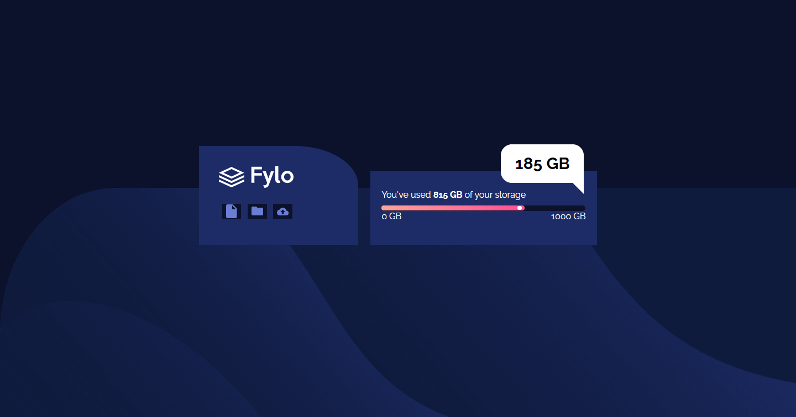
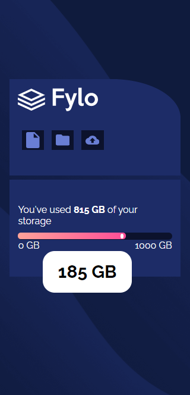

# Frontend Mentor - Fylo data storage component solution

This is a solution to the [Fylo data storage component challenge on Frontend Mentor](https://www.frontendmentor.io/challenges/fylo-data-storage-component-1dZPRbV5n). Frontend Mentor challenges help you improve your coding skills by building realistic projects. 

## Table of contents

- [Overview](#overview)
  - [The challenge](#the-challenge)
  - [Screenshot](#screenshot)
  - [Links](#links)
- [My process](#my-process)
  - [Built with](#built-with)
- [Author](#author)

## Overview

### The challenge

Users should be able to:

- View the optimal layout for the site depending on their device's screen size

### Screenshot
### computer screen

### mobile screen

### Links

- Solution URL: [solution URL](https://www.frontendmentor.io/solutions/htmlcssflexbox-gD28GdwhK)
- Live Site URL:  [live site URL](https://gigagiorgadze.github.io/fylo-data-storage-component-master/)

## My process

### Built with

- Semantic HTML5 markup
- CSS custom properties
- Flexbox
## Author

- Frontend Mentor - [@GigaGiorgadze](https://www.frontendmentor.io/profile/GigaGiorgadze)
- Twitter - [@giorgadze_11](https://www.twitter.com/giorgadze_11)

